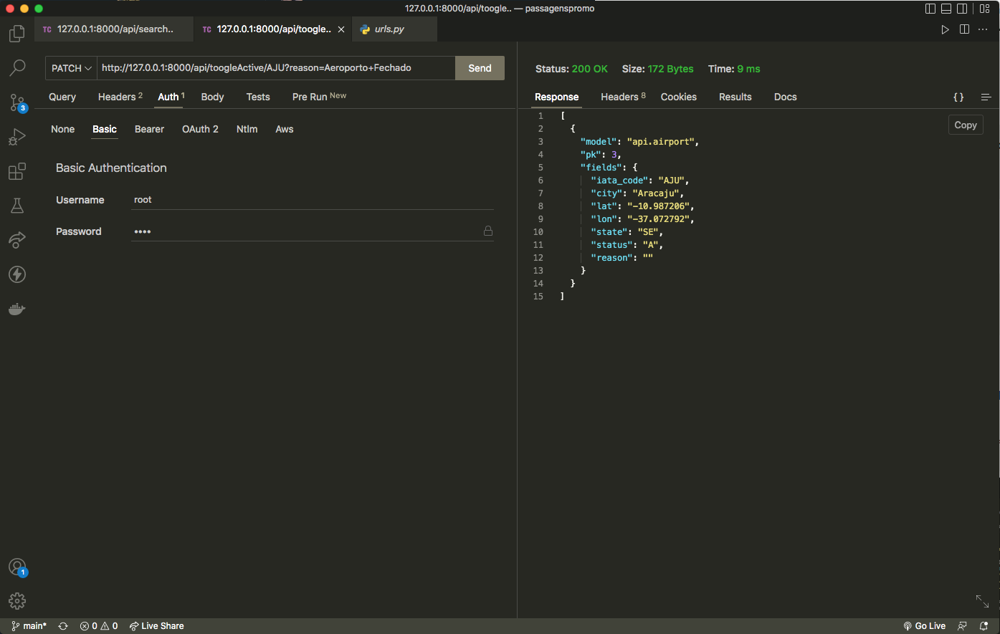

# Techinical Test Amopromo

## Stack used

| Front-end | Back-end | Database | Ambient |
| --- | --- | --- | --- |
| React | Django | SQLite | Docker |

## Description

This application is used to check available flights and round trips between national airports, bringing the best and cheapeast routes, with their respective prices including taxes, distances, exact location of airports, etc. 

Airports can be ignored by means of deactivation through a web panel. 

## Installation step by step

- clone the repository and run the container

```bash
git clone https://github.com/renantorres07/passagenspromo.git
```

- run the command;

```bash
docker-compose up;
```

- After these steps, you will have the backend accessible on port 8000, and the frontend on port 3000, both on localhost, where airports can be inactivated as long as a reason is provided.

## Endpoints

.

<aside>
💡 For all endpoints a Token should be passed along the request, inside the header, with the key "token”, the token is '3y4WXfiBN8pRaXvaVe8jzyNCCXnnSu9gmaUFvJMaJxXvesUtwEuaP98A8PZSzwCW9TiQhFUtByMaXHVt8yYU7inzhTfmfYRTR3umyiBeHu9ktDJGcyhyTJzhsSfgmJSR’
#OBS - CRIAR ENDPOINT PARA RETORNAR O TOKEN

</aside>

- Activate an Inactive Airport.

```python
http://127.0.0.1:8000/api/toogleactive/AJU
```



- Inactivate and Active Airport, the reason should be passed as a URL Param.

```python
http://127.0.0.1:8000/api/toogleinactive/AJU?reason=Aeroporto+Fechado
```


- Search Flights, ##COLOCAR O QUE  É CADA PARAMETRO DA URL (AEROPORTO DE SAIDA, CHEGADA, DATA, ETC)

```python
http://127.0.0.1:8000/api/search/MAO/POA/2023-06-15/2023-06-20
```

